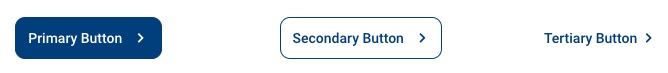

# Custom Styles&nbsp;&nbsp;/&nbsp;&nbsp;Button

&nbsp;

[Acquia Site Studio](https://www.acquia.com/products/drupal-cloud/site-studio) must be installed for these configurations to operate. 
These custom styles are to used only with `<button>` elements, not `<a href>` elements.

&nbsp;

### Usage:

- To import a configuration, navigate to **Configuration** in the Drupal administrator toolbar.
- Go to **Development > Configuration synchronization**. Then to the **Import** tab and select **Single item**.
- Under the **Configuration type** dropdown, select **Custom style**.
- Copy and paste the code content of an individual YML file into the **Paste your configuration here** field.
- Click **Import** and follow the instructions for syncing.
- To check if a configuration was properly imported navigate to **Site Studio** in the Drupal administrator toolbar.
- Go to **Styles > Custom styles**, the imported configuration should be listed under **Button**.

&nbsp;

