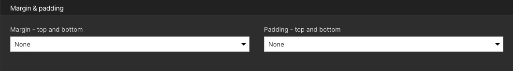
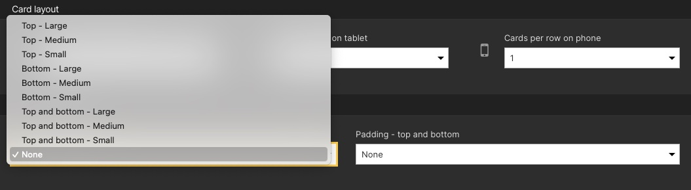
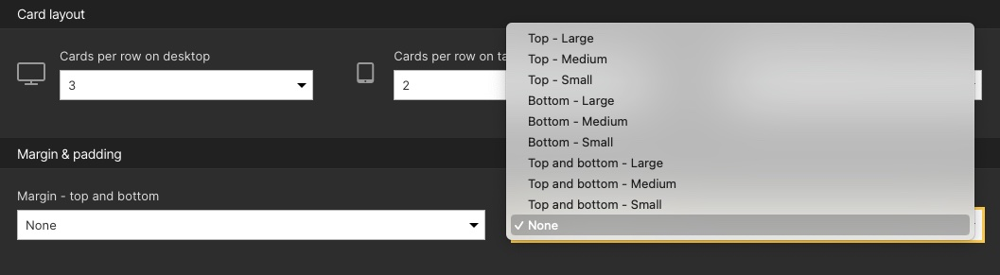

# Custom Styles : Layout : Margin & Padding

### Usage:

- To import a configuration, navigate to **Configuration** in the Drupal administrator toolbar.
- Go to **Development > Configuration synchronization**. Then to the **Import** tab and select **Single item**.
- Under the **Configuration type** dropdown, select **Image style**.
- Copy and paste the code content of an individual YML file into the **Paste your configuration here** field.
- Click **Import** and follow the instructions for syncing.
- To check if a configuration was properly imported navigate to **Configuration** in the Drupal administrator toolbar.
- Go to **Media > Image styles**, the imported configuration should be listed.

